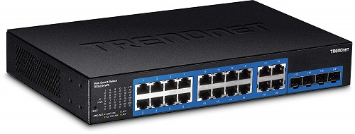

# El hub

## 1. Acerca del hub:
El **hub** (también llamado *concentrador*) es un dispositivo que permite **centralizar la conexión de una red** de varios equipos en físico, creando una **red LAN** (*Local Area Network*).
  

## 2. Robert Metcalfe:
Este dispositivo fue inventado por el ingeniero **Robert Metcalfe** en el año **1980**, con una velocidad máxima soportada de ***10 megabits***, algo que se queda muy corto si los comparamos con los ***1000 megabits*** que soportan algunos de estos a día de hoy.

## 3. Peor que un switch?
Opera en la **capa de acceso medio** del modelo **TCP/IP** (la equivalente a la capa física del modelo *OSI*)  de manera que este recibe una señal y la repite por sus puertos ethernet (*RJ45*) sin dirigir el tráfico a ninguno en concreto, al contrario que un *switch*, pero los hubs suelen ser **más baratos** que estos.

# Ejemplo de hub y switch
 

  

##### Más información en [este artículo](https://es.wikipedia.org/wiki/Concentrador) de Wikipedia