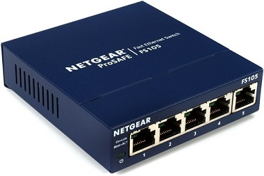

# El hub

El **hub** (también llamado *concentrador*) es un dispositivo que permite centralizar la conexión de una red de varios equipos en físico.

Fue inventado por el ingeniero **Robert Metcalfe** en el año 1980, con una velocidad máxima soportada de ***10 megabits***, algo que se queda muy corto si los comparamos con los ***1000 megabits*** que soportan algunos de estos a día de hoy.

Opera en la **capa de acceso medio** del modelo **TCP/IP** (la equivalente a la capa física del modelo *OSI*) de manera que este recibe una señal y la repite por sus puertos físicos sin dirigir el tráfico a ninguno en concreto, al contrario que un *switch*.

Los *hubs* suelen usar varios **puertos ethernet** (*RJ45*) y suelen ser más **económicos** que un *switch*.

 

## 3 datos a mayores:

- Fue el ingeniero Robert Metcalfe quien inventó en 1980 este dispositivo
- Al principio solo soportaba una velocidad de hasta 10 megabits
- A día de hoy hemos llegado hasta una velocidad teórica soportada de hasta 1000 megabits, unas 100 veces más  
   
  

##### Más información en [este artículo de Wikipedia](https://es.wikipedia.org/wiki/Concentrador)